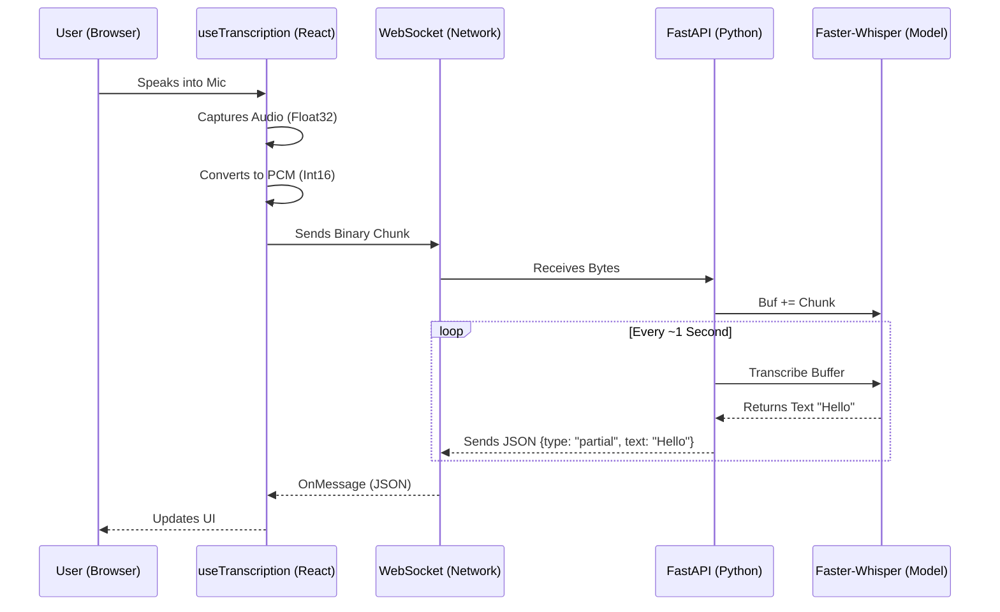

# How It Works: End-to-End Architecture

This document explains the technical lifecycle of a voice command, from the user's microphone in the React frontend to the Python backend and back as text.

## 1. The Big Picture



---

## 2. Frontend: Capturing & Converting
**Location**: `src/hooks/useTranscription.ts`

1.  **Capture**: We use the browser's `navigator.mediaDevices.getUserMedia({ audio: true })` to get the raw microphone stream.
2.  **Processing**: We attach a `ScriptProcessorNode` (or `AudioWorklet`) to the audio context.
    *   This node wakes up every 4096 samples (approx every 250ms at 16kHz).
3.  **Conversion**: Use `convertFloatTo16BitPCM`:
    *   Browser audio is **Float32** (range `-1.0` to `1.0`).
    *   Faster-Whisper expects **Int16** (range `-32768` to `32767`).
    *   We multiply by `0x7FFF` to convert.
4.  **Transmission**: The `Int16Array` buffer is sent directly over the WebSocket as a binary blob.

## 3. The Network: WebSocket Tunnel
**Transport**: `ws://` or `wss://`

*   The connection is persistent. Unlike HTTP POST, we don't open/close connections.
*   Binary data flows *Up* (Client -> Server).
*   JSON text flows *Down* (Server -> Client).

## 4. Backend: Buffering & Transcribing
**Location**: `asr/main.py` & `asr/asr.py`

1.  **Reception**: `main.py` receives the bytes and passes them to `asr_model.process_audio_chunk()`.
2.  **Normalization**: The Python side converts the Int16 bytes *back* to Float32 (normalized `/ 32768.0`) because the internal Whisper model actually runs on floats.
3.  **Buffering**: We don't transcribe every micro-chunk. We append them to a growing `self.audio_buffer`.
4.  **Inference Trigger**:
    *   The loop in `main.py` checks if we have enough audio (e.g., > 1 second).
    *   It calls `self.model.transcribe()`.
    *   **Faster-Whisper**: This library uses CTranslate2 (C++ acceleration) to run the OpenAI Whisper model highly efficiently.
5.  **Response**: The resulting text string is wrapped in JSON:
    ```json
    { "type": "partial", "text": "Hello world" }
    ```

## 5. Frontend: Display
**Location**: `src/components/pages/Session-ui.tsx`

1.  The `useTranscription` hook receives the JSON message.
2.  It updates the `transcript` state variable.
3.  React triggers a re-render.
4.  The `<div className="absolute ...">` overlay displays the new text.

## Why this Architecture?
*   **Low Latency**: WebSockets eliminate the HTTP handshake overhead.
*   **Privacy**: Audio is processed entirely on your server (or localhost), never sent to a third party.
*   **Efficiency**: `Faster-Whisper` is up to 4x faster than standard Whisper thanks to Int8 quantization.

---

## 6. Deep Dive: Faster-Whisper
You asked: *"Is it calling an LLM API?"*
**Answer: NO.** It is running 100% locally on your machine.

### How it works internally
1.  **Local Model**: When the service starts, it downloads a binary model file (e.g., `tiny.en.bin`) from HuggingFace to your hard drive.
2.  **Transformer Architecture**: Use OpenAI's Whisper (a Transformer neural network) trained on 680,000 hours of audio.
3.  **CTranslate2**: This is the "secret sauce". Standard Whisper runs on PyTorch which can be heavy. `faster-whisper` rewrites the model using CTranslate2, a C++ inference engine that makes it much lighter and faster.
4.  **No Internet Needed**: Once the model is downloaded, you can unplug your internet, and it will still transcribe perfectly.

---

## 7. Deep Dive: Docker
You asked: *"What is Docker and how does it help?"*

### The Problem
If you send this code to a friend, they might not have Python installed. Or they have Python 3.9 instead of 3.10. Or they are missing C++ tools. The app crashes. "It works on my machine" is the classic developer nightmare.

### The Docker Solution
Docker creates a **Container**—a lightweight, self-contained mini-computer that runs inside your computer.

### Functionalities in this Project
1.  **Isolation**: The `Dockerfile` says "Start with a clean Linux machine, install Python 3.10, install these exact libraries."
2.  **Reproducibility**: If it runs on your machine in Docker, it guarantees it runs on AWS, your friend's laptop, or a Raspberry Pi exactly the same way.
3.  **No Installation Mess**: You don't need to pollute your main computer with dependencies. To "uninstall" the service, you just delete the container.

**Analogy**:
*   **Running locally**: Baking a cake in your friend's kitchen. You hope they have flour, eggs, and a working oven.
*   **Running with Docker**: Bringing a fully equipped mobile kitchen truck that has everything already inside. You just park it and start baking.
